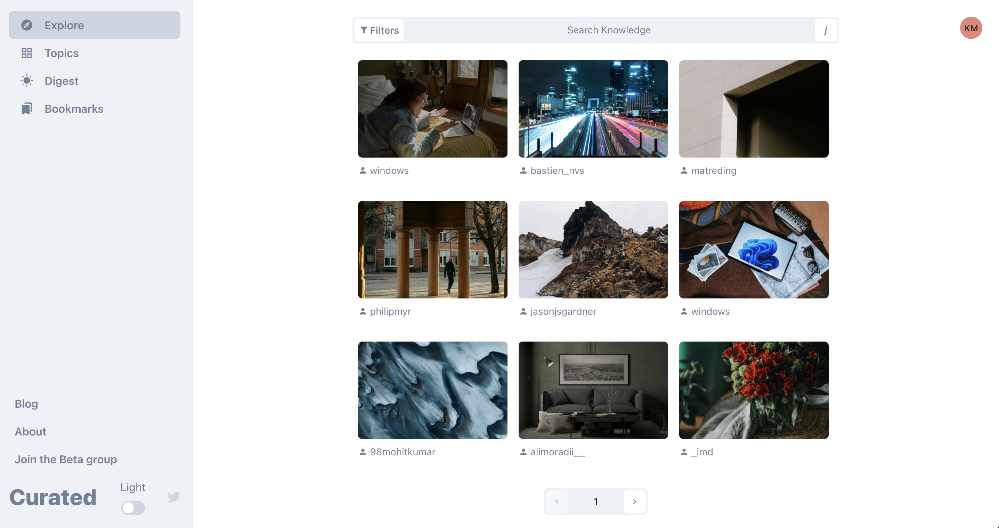
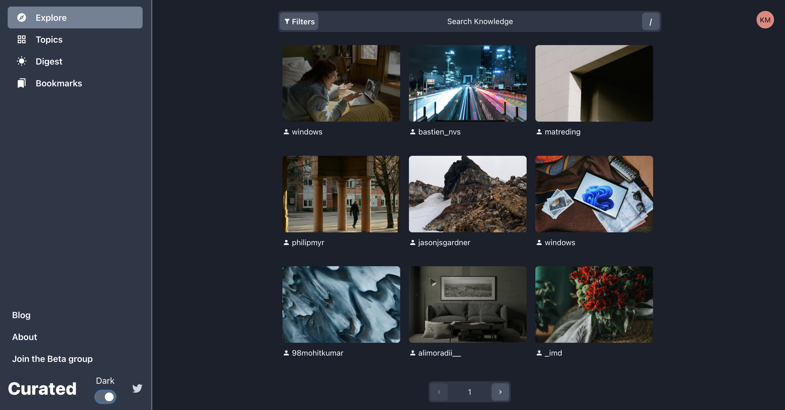
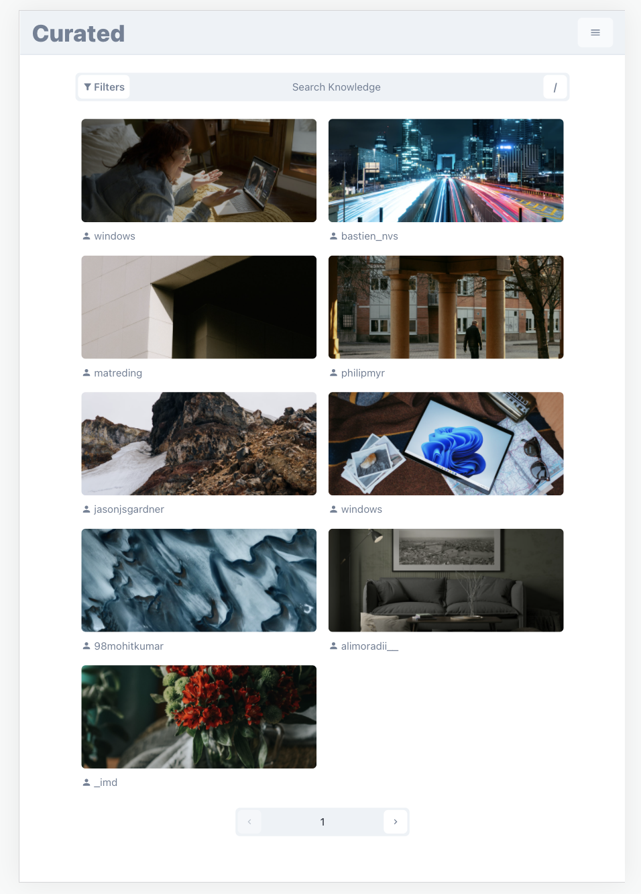
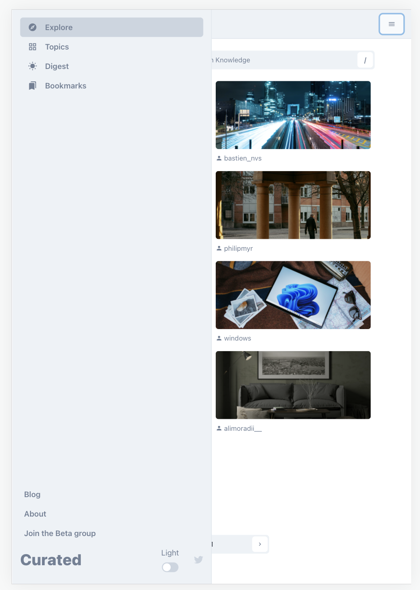
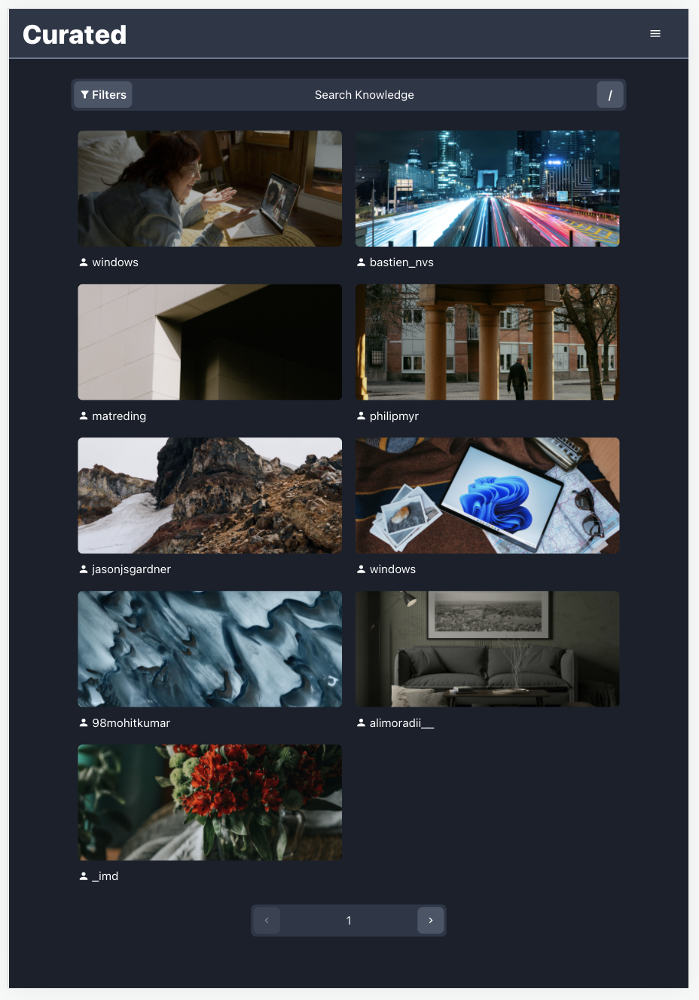
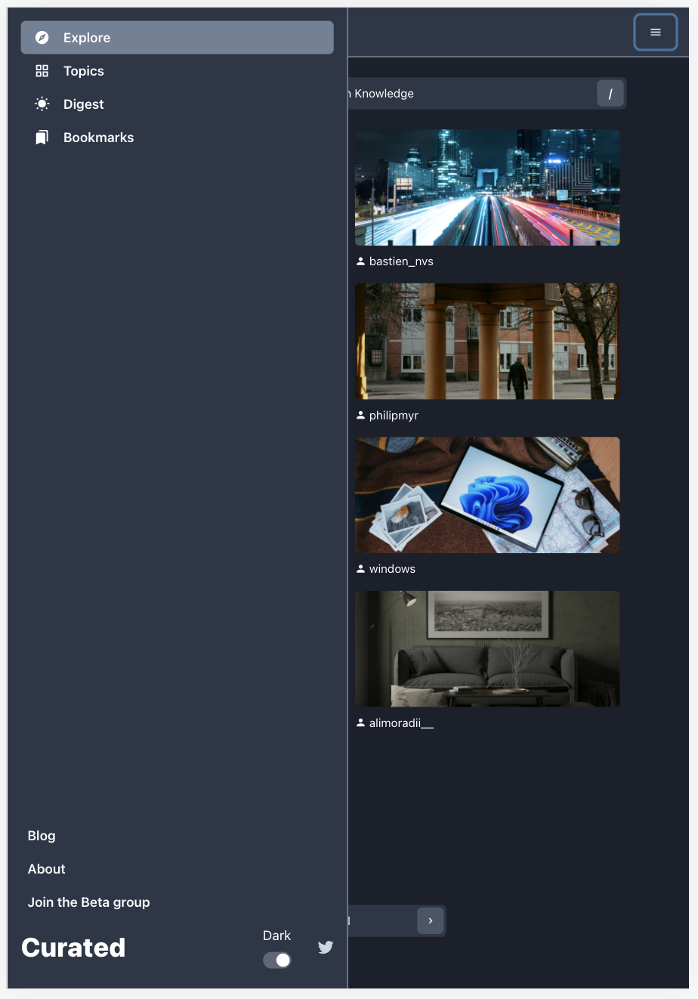
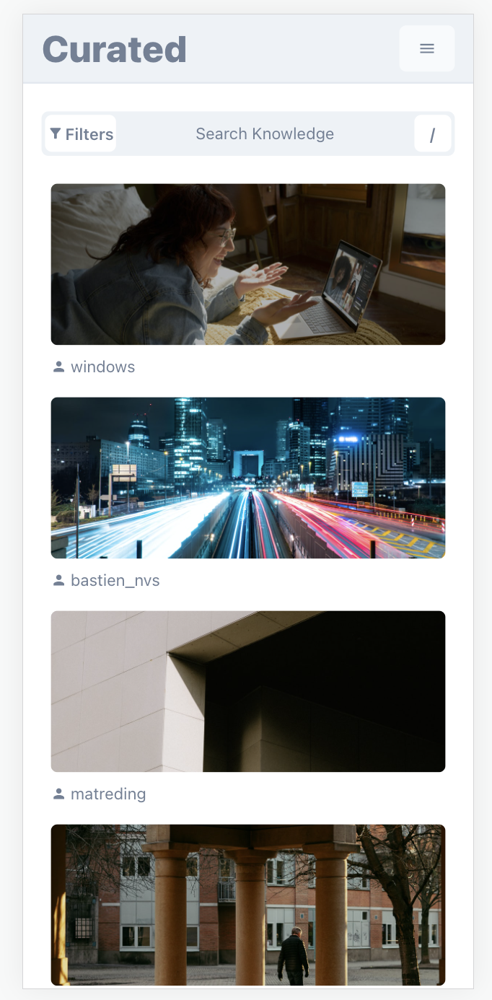
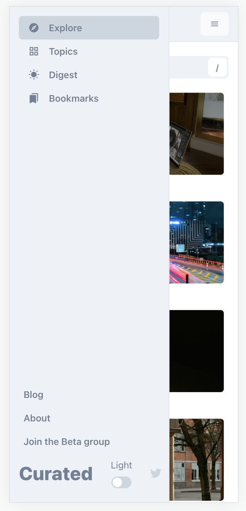
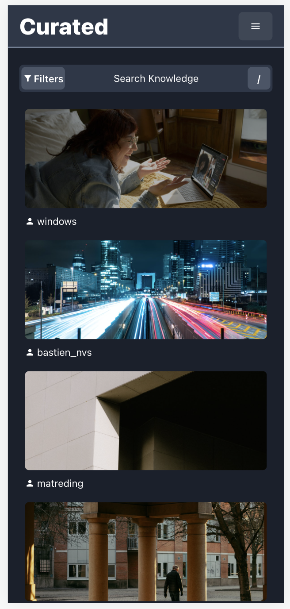
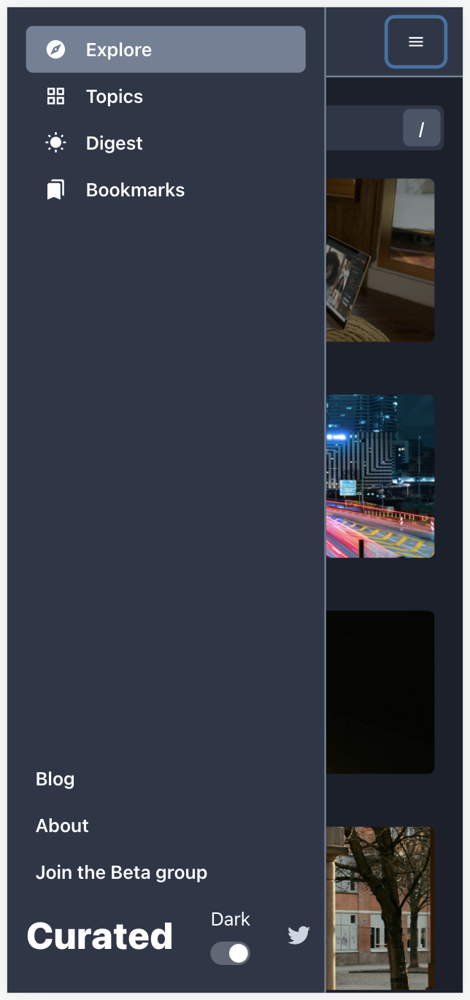

<!-- ABOUT THE PROJECT -->

## Developer Test

#### Desktop view

 

#### Tablet view

 
<br/>
 

#### Mobile view

   

This project includes frontend and backend which is providing a website to search photos from [Unsplash](https://unsplash.com).

### Built With

1. [React.js](https://reactjs.org/)
2. [Express.js](https://expressjs.com/)
3. [TypeScript](https://www.typescriptlang.org/)
4. [Chakra UI](https://chakra-ui.com/)

<!-- GETTING STARTED -->

## Getting Started

### Prerequisites

- npm
  ```sh
  npm install npm@latest -g
  ```

### Installation

1. Get a free Access Key at [Unsplash](https://unsplash.com/developers)
2. Clone the repo
   ```sh
   git clone https://github.com/kaman0916/developer-test.git
   ```
3. Install NPM packages for backend service
   ```sh
   cd backend
   npm install
   ```
4. Enter your API in `backend/.env`

   ```js
   // Node.js server configuration
   PORT = 8080;
   // Unsplash API
   UNSPLASH_ACCESS_KEY = "API Access Key";
   // Keyword record file
   RECORD_PATH = record.csv;
   ```

5. Start backend service

   ```js
   npm start
   ```

6. Install NPM packages for frontend service

   ```sh
   cd frontend
   npm install
   ```

7. Enter your API in `frontend/.env`

   ```js
   // Backend API url with port
   REACT_APP_API=http://localhost:8080
   ```

8. Start frontend website

   ```js
   npm start
   ```
